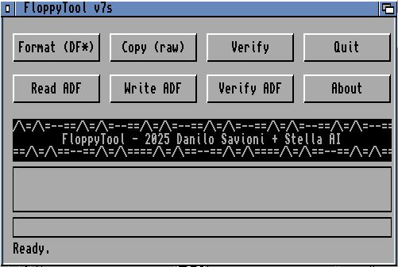

Technical Description

FloppyTool is written in C for AmigaOS 68k and compiled with VBCC, ensuring compatibility across classic Amiga systems from the A500 to the A1200. The code follows AmigaOS conventions for GUI and system calls, keeping dependencies minimal and performance high on constrained hardware.

The interface is built using Intuition and GadTools libraries, providing a compact two-row layout with ASCII banner header. Operations are fully event-driven and optimized for responsiveness on OCS/ECS/AGA machines. The UI avoids unnecessary complexity, using standard ASL requesters for file selection and a lightweight progress bar for real-time feedback.

Core disk operations (format, copy, verify) directly use trackdisk.device calls, while ADF support is implemented via raw I/O handlers for reading and writing disk images. Verification includes file size checks and CRC32 calculation, giving users immediate integrity confirmation. The code structure is modular, with separate routines for UI, disk I/O, error handling, and progress reporting, making it easy to extend with future features like write-protection checks, auto-retry on errors, or stored user preferences in ENVARC:.
